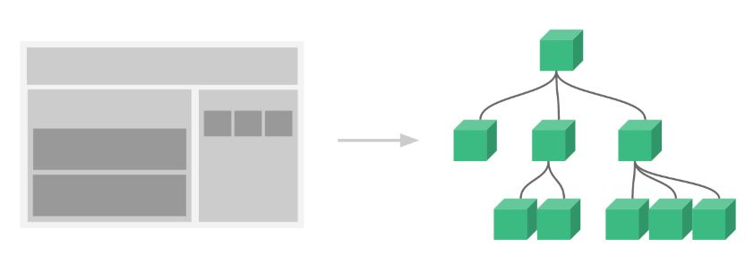

## 组件基础 （components）

###### 组件是可复用的 Vue 实例，且带有一个名字。

###### 因为组件是可复用的 Vue 实例，所以它们与 new Vue 接收相同的选项，例如 data、computed、watch、methods 以及生命周期钩子等。仅有的例外是像 el 这样根实例特有的选项。


#### 1. 自定义组件的特点：

* data 必须是一个函数
```html
# 一个组件的 data 选项必须是一个函数，因此每个实例可以维护一份
# 被返回对象的独立的拷贝

data: function () {
  return {
    count: 0
  }
}
```

* 组件的组织，通常一个应用会以一棵嵌套的组件树的形式来组织 <br>
 <br>

* 有两种组件的注册类型：全局注册和局部注册
```html
// 全局注册
Vue.component('my-component-name', {
  // ... options ...
})

// 局部注册
var TodoItem = {
    props: ["content"],
    template: "<li>{{content}}</li>"
}

var app = new Vue({
    el: "#root",
    components: {
        // 局部组件注册
        TodoItem: TodoItem
    },
    data: {
        ...
    },
    methods: {
        ...
    }
})
```


#### 2. 通过 Prop 向子组件传递数据

###### Prop 是你可以在组件上注册的一些自定义特性。当一个值传递给一个 prop 特性的时候，它就变成了那个组件实例的一个属性。

###### 一个组件默认可以拥有任意数量的 prop，任何值都可以传递给任何 prop。

一个 prop 被注册之后，你就可以像这样把数据作为一个自定义特性传递进来：
```html
<blog-post title="My journey with Vue"></blog-post>
<blog-post title="Blogging with Vue"></blog-post>
<blog-post title="Why Vue is so fun"></blog-post>
```
在一个典型的应用中，你可能在根组件的 data 中有一个数组
```html
new Vue({
  el: '#blog-post-demo',
  data: {
    posts: [
      { id: 1, title: 'My journey with Vue' },
      { id: 2, title: 'Blogging with Vue' },
      { id: 3, title: 'Why Vue is so fun' }
    ]
  }
})
```
###### 可以使用 v-bind 来动态传递 prop:
```html
<blog-post
  v-for="post in posts"
  v-bind:key="post.id"
  v-bind:title="post.title"
></blog-post>
```
###### 如果你一开始不清楚要渲染的具体内容，比如从一个 API 获取博文列表的时候，是非常有用的。


#### 3. 单个根元素

###### 每个组件必须只有一个根元素
```html
<blog-post
  v-for="post in posts"
  v-bind:key="post.id"
  v-bind:post="post"
></blog-post>

# 单个根元素 <div class="blog-post"></div>
Vue.component('blog-post', {
  props: ['post'],
  template: `
    <div class="blog-post">
      <h3>{{ post.title }}</h3>
      <div v-html="post.content"></div>
    </div>
  `
})
```


#### 4. 通过事件向父级组件发送消息

######  Vue 实例提供了一个自定义事件的系统，我们可以调用内建的 $emit 方法并传入事件的名字，来向父级组件触发一个事件。

###### 使用事件抛出一个值
```html
# 有的时候用一个事件来抛出一个特定的值是非常有用的
# 可以使用 $emit 的第二个参数来提供这个值

<button v-on:click="$emit('enlarge-text', 0.1)">
  Enlarge text
</button>

# 父级组件监听这个事件的时候，可以通过 $event 访问到被抛出的这个值
<blog-post
  ...
  v-on:enlarge-text="postFontSize += $event"
></blog-post>

# 或者，如果这个事件处理函数是一个方法，这个值将会作为第一个参数传入这个方法
<blog-post
  ...
  v-on:enlarge-text="onEnlargeText"
></blog-post>

methods: {
  onEnlargeText: function (enlargeAmount) {
    this.postFontSize += enlargeAmount
  }
}
```


#### 5. 在自定义组件上使用 v-model

###### 自定义事件也可以用于创建支持 v-model 的自定义输入组件。
```html
<input v-model="searchText">

等价于：

<input
  v-bind:value="searchText"
  v-on:input="searchText = $event.target.value"
>
```

###### 让它正常工作，这个组件内的 \<input> 必须：
* 将其 value 特性绑定到一个名叫 value 的 prop 上。
* 在其 input 事件被触发时，将新的值通过自定义的 input 事件抛出。

由此，代码如下：
```html
Vue.component('custom-input', {
  props: ['value'],
  template: `
    <input
      v-bind:value="value"
      v-on:input="$emit('input', $event.target.value)"
    >
  `
})
```

现在 v-model 就应该可以在这个组件上完美地工作起来了：
```html
<custom-input v-model="searchText"></custom-input>
```


#### 6. 通过插槽分发内容
```
TODO
```


#### 7. 动态组件

###### 有的时候，在不同组件之间进行动态切换是非常有用的。

可以通过 Vue 的 <component> 元素加一个特殊的 is 特性来实现：
```html
<!-- 组件会在 `currentTabComponent` 改变时改变 -->
<component v-bind:is="currentTabComponent"></component>
```

在上述示例中，currentTabComponent 可以包括
```
* 已注册组件的名字，或
* 一个组件的选项对象
```


#### 8. 解析 DOM 模板时的注意事项

###### 有些 HTML 元素，诸如 \<ul>、\<ol>、\<table> 和 \<select>，对于哪些元素可以出现在其内部是有严格限制的。而有些元素，诸如 \<li>、\<tr> 和 \<option>，只能出现在其它某些特定的元素内部。

特殊的 is 特性给了我们一个变通的办法:
```html
<table>
  <tr is="blog-post-row"></tr>
</table>
```

###### 需要注意的是如果我们从以下来源使用模板的话，这条限制是不存在的：
```
* 字符串 (例如：template: '...')
* 单文件组件 (.vue)
* <script type="text/x-template">
```
