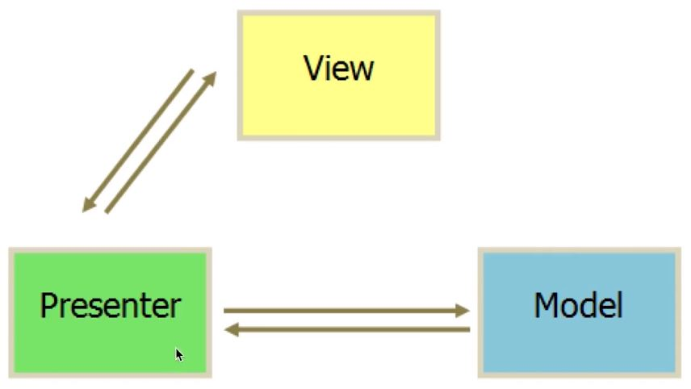
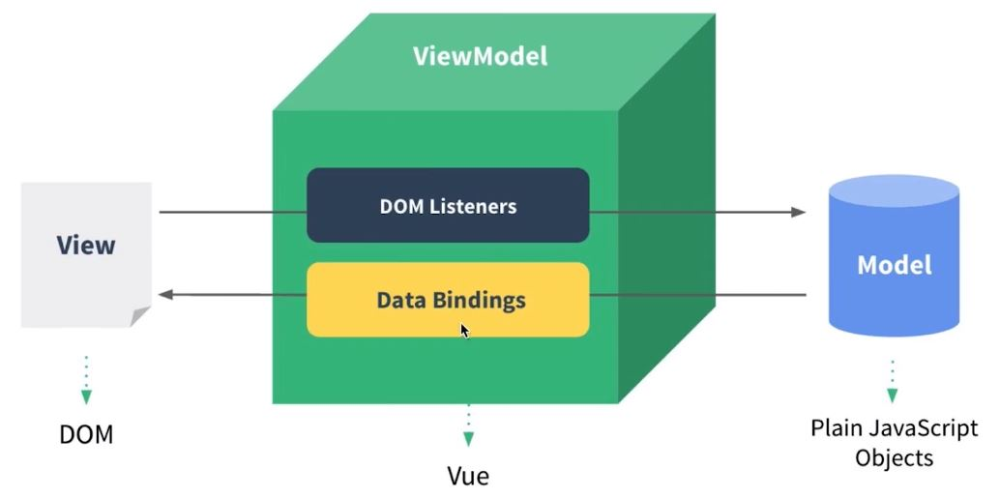

# VueJS Quick Start
官方教程，请参考：https://cn.vuejs.org/v2/guide

## Your First Vue
```html
<!doctype html>
<html>
<head>
    <meta charset="UTF-8">
    <meta name="viewport"
          content="width=device-width, user-scalable=no, initial-scale=1.0, maximum-scale=1.0, minimum-scale=1.0">
    <meta http-equiv="X-UA-Compatible" content="ie=edge">
    <title>Hello, World</title>
    <script src="https://cdn.jsdelivr.net/npm/vue/dist/vue.js"></script>
</head>
<body>

<div id="app">{{content}}</div>

<div>{{content}}</div>

<script>
    // var dom = document.getElementById("app")
    // dom.innerHTML = "hello, world"

    // setTimeout(function() {
    //     dom.innerHTML = "bye, world"
    // }, 2000)

    var app = new Vue({
        el: "#app",
        data: {
            content: "hello, vuejs"
        }
    })

    setTimeout(function() {
        app.$data.content = "bye, vuejs"
    }, 2000)
</script>
</body>
</html>
```
code link: [helloworld.html](./helloworld.html)

注意事项：
* el - DOM元素绑定
* data 对象
* $data - vue成员对象引用

## TodoList Project
Contents:
* list object - vue 列表数据
* v-for="item in list" - 列表遍历
* v-on:[event]="functionName" - 事件绑定
* methods - vue 函数成员
* v-model="inputValue" - 数据的双向绑定
```html
<!DOCTYPE html>
<html lang="en">
<head>
    <meta charset="UTF-8">
    <title>TodoList</title>
    <script src="https://cdn.jsdelivr.net/npm/vue/dist/vue.js"></script>
</head>
<body>
<div id="app">
    <input type="text" v-model="inputValue">
    <button v-on:click="handleBtnClick">提交</button>
    <ul>
        <li v-for="item in list">{{item}}</li>
    </ul>
</div>
<script>
    var app = new Vue({
        el: "#app",
        data: {
            list: ["item 1", "item 2"],
            inputValue: ""
        },
        methods: {
            handleBtnClick: function() {
                this.list.push(this.inputValue);
                //alert(this.inputValue)
                this.inputValue = "";
            }
        }
    })
</script>
</body>
</html>
```
code link: [practices/TodoList.html](./practices/TodoList.html)

## VueJS - MVVM 模式
* MVP 模式 - 面向 DOM 进行开发

    *Model(数据层)、View(视图层/DOM展示)、Presenter(业务逻辑/控制层)*

    [TodoList Jquery](./practices/TodoList_Jquery.html)
    ```html
    <!DOCTYPE html>
    <html lang="en">
    <head>
        <meta charset="UTF-8">
        <title>Title</title>
        <script src="https://code.jquery.com/jquery-3.1.1.min.js"></script>
    </head>
    <body>
    <!--视图-->
    <div id="app">
        <input id="input" type="text" >
        <button id="btn">提交</button>
        <ul id="list">
            <li>item 1</li>
        </ul>
    </div>
    <script>
        // MVP模式： M 模型层（Ajax请求） V 视图 P 控制器
        function Page() {

        }

        $.extend(Page.prototype, {
            init: function() {
                this.bindEvents()
            },
            bindEvents: function() {
                var btn = $("#btn");
                btn.on("click", $.proxy(this.handleBtnClick, this))
            },
            handleBtnClick: function() {
                //alert("123");
                var inputElem = $("#input");
                var inputValue = inputElem.val();
                var ulElem = $("#list");
                ulElem.append("<li>" + inputValue + "</li>");
                inputElem.val("");
            }
        })

        var page = new Page();
        page.init();
    </script>
    </body>
    </html>
    ```
    *$ 是 JQuery 常用的一个回传函数，定义为 "选取". 英文是 selector 的缩写*

    ***MVP 模式中，Presenter（控制） 层是编码核心，Model层为边缘层***
    

* MVVM 模式 - 面向数据进行编程

    [TodoList Vue](./practices/TodoList.html)
    ```html
    refer to TodoList Project
    ```
    ***MVVM 模式中, VM 层为 Vue 内置，编码重点一部分在视图层，一部分在模型层***
    
